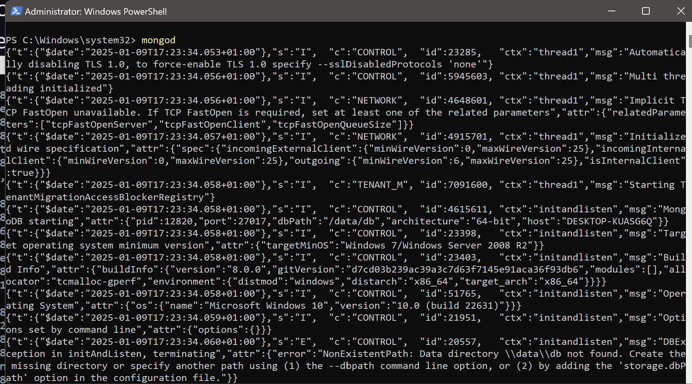
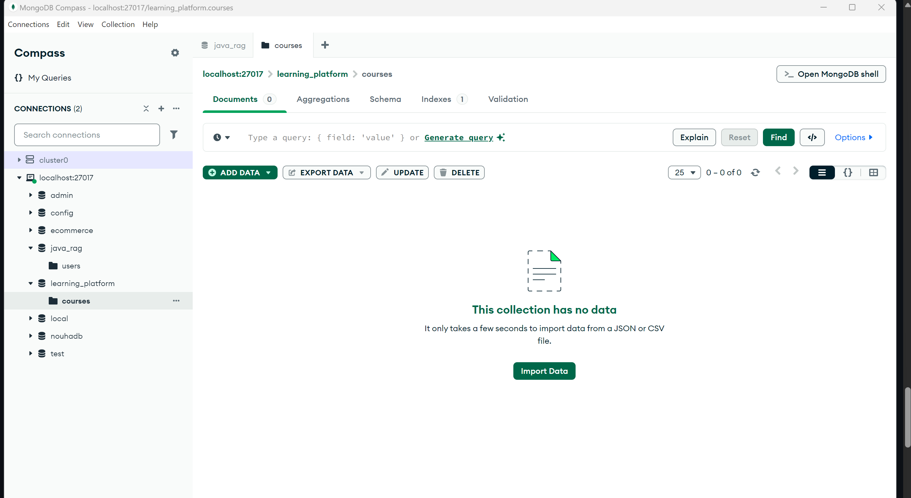
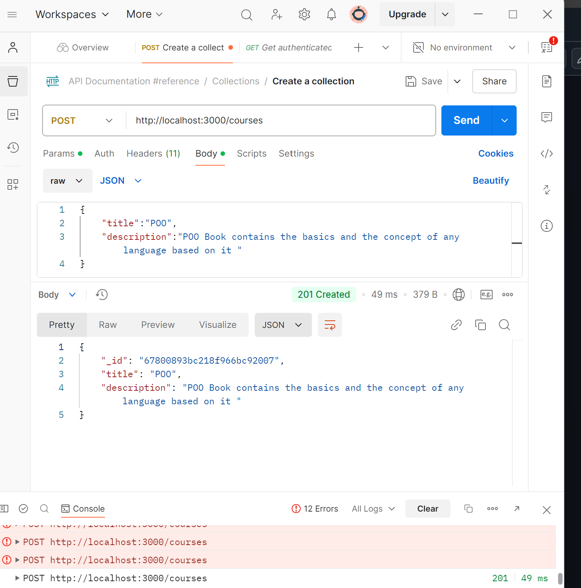
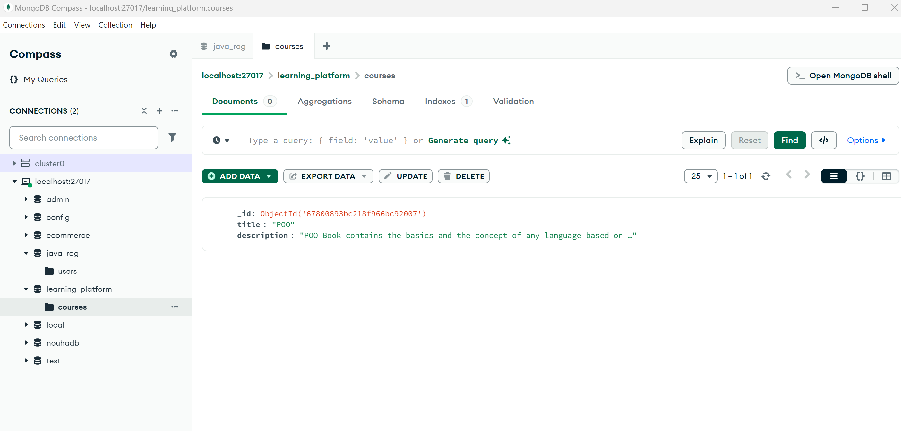
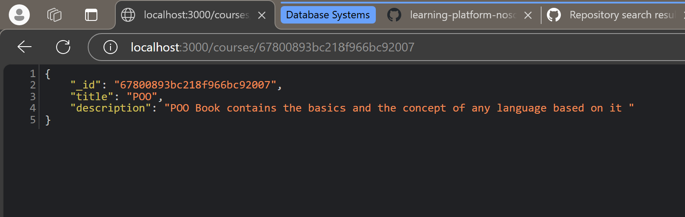
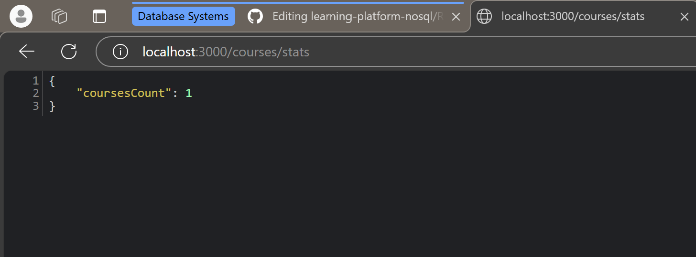

# Course Management System

Pour ce projet, on va créer une petite API qui va servir de backend à une plateforme d'apprentissage en ligne.

Commençons par l'organisation pratique :

## Structure du Projet

- `config/`: Gestion des connexions (MongoDB, Redis) et variables d'environnement.
- `controllers/`: Logique métier des entités (exemple: `CourseController`).
- `routes/`: Points d'entrée API pour chaque ressource.
- `services/`: Utilitaires pour manipuler les données.
- `app.js`: Point d'entrée principal.

## Réponses aux Questions

### 1. `config/db.js`

#### Question : Pourquoi créer un module séparé pour les connexions aux bases de données ?
  - **Réponse** :  
    Créer un module séparé pour les connexions aux bases de données permet de centraliser et réutiliser la logique de connexion, de simplifier la maintenance du code, et d'améliorer la lisibilité. Cela facilite également la gestion des erreurs et des paramètres de configuration, tout en permettant une meilleure séparation des responsabilités (respect du principe SOLID).

#### Question : Comment gérer proprement la fermeture des connexions ?
  - **Réponse** :  
    Gérer proprement la fermeture des connexions se fait en écoutant les événements système comme `SIGTERM` (terminaison de l'application) pour s'assurer que les ressources sont libérées avant l'arrêt de l'application, empêchant ainsi des fuites de ressources.

### 2. `config/env.js`

#### Question : Pourquoi est-il important de valider les variables d'environnement au démarrage ?
  - **Réponse** :  
    Valider les variables d'environnement au démarrage permet de s'assurer que l'application dispose de toutes les informations nécessaires à son bon fonctionnement, évitant ainsi des erreurs imprévues en cours d'exécution.

#### Question : Que se passe-t-il si une variable requise est manquante ?
  - **Réponse** :  
    L'application doit arrêter son exécution et afficher un message d'erreur explicite pour éviter des comportements imprévus et faciliter le débogage.

### 3. `controllers/courseController.js`

#### Question : Quelle est la différence entre un contrôleur et une route ?
  - **Réponse** :  
    Une route définit l'URL et le type de requête (GET, POST, etc.), tandis qu'un contrôleur contient la logique métier exécutée lorsque cette route est appelée.

#### Question : Pourquoi séparer la logique métier des routes ?
  - **Réponse** :  
    Séparer la logique métier des routes améliore la lisibilité et la maintenabilité du code. De plus, cela facilite les tests unitaires des contrôleurs.

### 4. `routes/courseRoutes.js`

#### Question : Pourquoi séparer les routes dans différents fichiers ?
  - **Réponse** :  
    Cela facilite la gestion et la lisibilité des routes, particulièrement dans les grandes applications avec de nombreux points d'entrée.

#### Question : Comment organiser les routes de manière cohérente ?
  - **Réponse** :  
    Il est recommandé de grouper les routes par fonctionnalité ou module, comme par exemple `courseRoutes.js` pour toutes les routes liées aux cours.

### 5. `services/mongoService.js`

#### Question : Pourquoi créer des services séparés ?
  - **Réponse** :  
    Cela permet de réutiliser la logique métier et de réduire la duplication dans les contrôleurs, rendant l'application plus modulaire et maintenable.

### 6. `services/redisService.js`

#### Question : Comment gérer efficacement le cache avec Redis ?
  - **Réponse** :  
    La gestion du cache avec Redis peut se faire en définissant des clés avec des durées d'expiration (TTL), ainsi qu'en invalidant les données obsolètes pour garantir que les utilisateurs reçoivent des informations actualisées.

#### Question : Quelles sont les bonnes pratiques pour les clés Redis ?
  - **Réponse** :  
    Utiliser des noms de clés descriptifs et éviter les collisions en définissant un préfixe pour chaque type de donnée, comme par exemple `courses:` pour les données liées aux cours.

### 7. `app.js`

#### Question : Comment organiser le point d'entrée de l'application ?
  - **Réponse** :  
    Le point d'entrée de l'application initialise les connexions aux bases de données, configure les middlewares, et monte les routes avant de démarrer le serveur pour qu'il soit prêt à recevoir des requêtes.

#### Question : Quelle est la meilleure façon de gérer le démarrage de l'application ?
  - **Réponse** :  
    Il est préférable d'utiliser des blocs `try-catch` pour capturer et gérer les erreurs au démarrage, ce qui permet d'éviter des problèmes d'exécution imprévus.

### 8. `.env`

#### Question : Quelles sont les informations sensibles à ne jamais commiter ?
  - **Réponse** :  
    Il ne faut jamais commettre des mots de passe, clés API, certificats, ou informations personnelles dans un dépôt Git. Utilisez un fichier `.gitignore` et des gestionnaires de secrets pour sécuriser ces données.

#### Question : Pourquoi utiliser des variables d'environnement ?
  - **Réponse** :  
    Les variables d'environnement permettent de stocker des informations sensibles et des configurations spécifiques à l'environnement sans les inclure directement dans le code source, offrant ainsi une meilleure sécurité, portabilité et flexibilité.

## Explication des Choix Techniques

### `src/app.js`

- **Initialiser les connexions aux bases de données** : Cette étape est cruciale pour garantir l'accès aux données nécessaires avant de démarrer le serveur.
- **Configurer les middlewares Express** : Les middlewares gèrent les requêtes et les réponses de manière modulaire, et leur configuration avant le démarrage du serveur garantit que toutes les requêtes passent par les middlewares.
- **Monter les routes** : En montant les routes avant de démarrer le serveur, toutes les routes sont prêtes à traiter les requêtes dès que le serveur est en ligne.
- **Démarrer le serveur** : Démarre effectivement le serveur pour qu'il commence à recevoir des requêtes.
- **Implémenter la fermeture propre des connexions** : Assure une fermeture propre des connexions aux bases de données pour libérer les ressources correctement.

### `src/config/env.js`

- **Validation des variables d'environnement** : Valider au démarrage s'assure que toutes les configurations nécessaires sont présentes et évite des erreurs en cours d'exécution.
- **Lever une erreur explicative si une variable manque** : Cela permet d'identifier rapidement les problèmes de configuration et de fournir des messages d'erreur clairs.

### `src/services/redisService.js`

- **Fonction générique de cache** : Implémenter une fonction générique de cache permet de réutiliser cette logique dans plusieurs parties de l'application.
- **Exporter les fonctions utilitaires** : Cela permet de réutiliser les fonctions de cache dans d'autres parties de l'application et d'assurer la cohérence du code.

### `src/controllers/courseController.js`

- **Séparer la logique métier des routes** : Cela améliore la gestion du code en séparant clairement la logique métier (contrôleur) et les points d'entrée (routes).
- **Implémenter la création d'un cours** : Utiliser des services pour gérer la logique réutilisable garantit que la logique métier reste centralisée et réutilisable.
- **Exporter les fonctions du contrôleur** : Cela permet de les utiliser dans les routes, garantissant une séparation claire entre la définition des routes et la logique métier.

### `src/services/mongoService.js`

- **Fonction générique de recherche par ID** : Implémenter une fonction générique de recherche par ID permet de centraliser la logique et de la réutiliser.
- **Exporter les fonctions utilitaires** : Cela permet d'utiliser les fonctions dans différents endroits de l'application, ce qui rend le code plus modulaire et maintenable.

### `src/config/db.js`

- **Créer un module séparé pour les connexions aux bases de données** : Cela centralise la logique de connexion, facilitant sa gestion et sa réutilisation.
- **Gérer proprement la fermeture des connexions** : Cela permet de libérer les ressources correctement et d'éviter des fuites de mémoire.
- **Exporter les clients et fonctions utiles** : Cela garantit que les connexions aux bases de données sont utilisées de manière cohérente dans toute l'application.

  # Instructions pour lancer le projet

## 1. Configurer Redis avec Docker

Pour configurer Redis, j'ai choisi d'utiliser directement l'image Redis depuis Docker. Voici les commandes que j'ai utilisées :

```bash
docker pull redis
docker run --name redis-container -p 6379:6379 -d redis
```

**Démarrer MongoDB:
Pour installé MongoDB dans ma machine, il faut  éxecuter la commande suivante:
```bash
mongod
```


**Démarrer l'application
Utiliser la commande 
```bash
npm start
``` 

**Si tu n'a pas le nodemon donc tu l'installe via ces commandes 
```bash

npm install nodemon --save-dev
npm install -g nodemon 

```
**Pour checher la version on mis 
```bash
nodemon -v
```

**Tester les API avec Postman
Au début notre base de données est vide il contient aucun cours: 



**Essayons d'ajouter quelques cours à notre collection en utilisant Postman: 



**Accédons à Mongo Compass pour voir si les données sont vraiment étées ajoutées:  



**Accédons via le web sur le port 3000: 

*getById: 


*getbystats:

